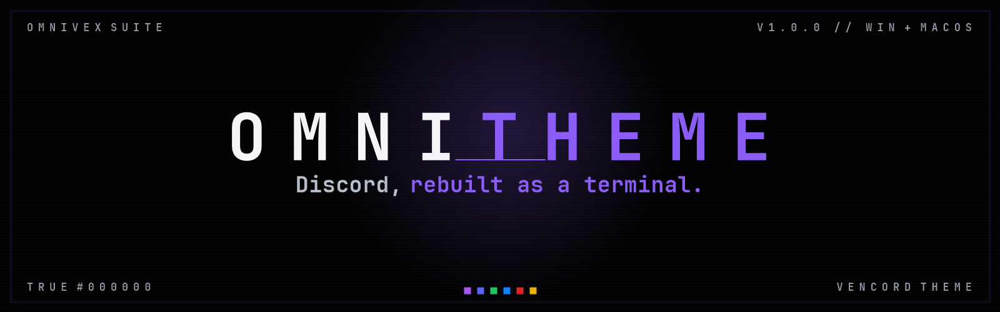

  

True black surfaces · falling code · CRT scanlines · Omnivex violet
Monospace end to end · a transparent window onto your desktop

[**Get it on Ko-fi**](https://ko-fi.com/theomnigrid) · [**Support on Patreon**](https://www.patreon.com/TheOmniGrid)

[**Get OmniTheme**](#how-to-get-it) · [Features](#features) · [FAQ](FAQ.md) · [Changelog](CHANGELOG.md)

---

<!-- Real in-client screenshots are pending — see docs/SCREENSHOTS.md. The only captures
     taken so far show other people's real Discord data and must not be published. -->

## What it is

A complete visual replacement for the Discord client. Not a colour tweak — every
surface, every corner radius, every typeface and every piece of chrome has been
rebuilt around one idea: **Discord as a piece of terminal software.**

It ships as an installer that does the tedious part for you. One double-click sets up
the theme, installs the font it needs, and switches on a curated set of 52 Vencord
plugins with preferences already tuned. No manual copying, no settings archaeology.

## What makes it different

**It is not a recolour.** Most themes swap a palette and call it a day. This one
replaces the type stack, the corner language, the density, the surface model and the
window itself — 2,400 lines of stylesheet, every rule written against the live client
rather than guessed.

**It ships the font.** Themes that name a font they do not provide fail silently — the
client just renders in something else and you never find out. OmniTheme bundles
JetBrains Mono and installs it for you, per-user, with no administrator rights.

**It is documented like software, not like a skin.** Every non-obvious rule carries the
reasoning behind it. Change one variable and the entire client follows.

---

## Six colours, one theme

  

| Variant | Hue | |
|---|---:|---|
| **Omnivex violet** | 302.6 | the canonical build |
| **Discord blurple** | 273.85 | Discord's own brand hue |
| **Matrix green** | 142 | phosphor bright |
| **Space blue** | 245 | |
| **Blood red** | 25 | alerts move to amber |
| **Bee yellow** | 90 | honey, not lemon |

Every variant is the identical theme with one thing changed: the accent ramp, regenerated
from a single hue. Same rules, same plugins, same installer — a variant is a hue, not a
fork. Install one over another and it replaces cleanly.

Supporters get **all six** in one download. Details in [Variants](docs/VARIANTS.md).

## Features

### The look

| | |
|---|---|
| **True `#000000` surfaces** | Not "very dark grey". Actual black, on every base layer. |
| **Omnivex violet** | The whole accent ramp derived in OKLCH from a single hue, so every shade sits on the same line instead of drifting. |
| **Falling code** | An animated stream of terminal commands behind the entire client. |
| **CRT scanlines** | A drifting hairline grid, and an occasional phosphor flicker. |
| **Monospace end to end** | JetBrains Mono across the client — chat, chrome, menus, settings. |
| **A transparent window** | The desktop shows faintly through, at an adjustable strength. |
| **Floating panels** | Sidebar, chat and member list lifted off the backdrop as separate cards. |
| **Violet rim glow** | A soft accent light around the window edge. |

### The details most themes miss

- **Unread DMs ring the sender's avatar** with a pulsing red circle and a soft outside
  glow, sitting neatly *under* the status dot — instead of a bar off to the side.
- **Mentions, unread counts and "NEW" chips share one alert language**, so a red pulse
  always means the same thing wherever you see it.
- **Square, hairline-framed avatars and badges**, with the status notch preserved.
- **Attachment cards are quieter** than the messages they hang off.
- **Every effect has an off switch** — one variable each for the rain, the CRT layer,
  the transparency and the glow.

### The installer

- **One double-click.** It clears the Windows downloaded-file mark itself — the single
  most common reason a theme installer appears to do nothing.
- **Offers to close and reopen Discord**, because window transparency is a startup flag
  and a half-applied theme looks like a broken one.
- **Merges, never replaces.** Your other plugins, their settings and every unrelated key
  keep their values. It backs up first, validates its own output before writing, and
  writes atomically.
- **Refuses clearly.** No Vencord? It tells you whether you have BetterDiscord, Discord
  without Vencord, or neither — three different problems, three different messages.
- **Installs the font per-user.** No administrator prompt, ever.

---

## Requirements

| | |
|---|---|
| **Client** | [Vencord](https://vencord.dev/download) (or Vesktop), run at least once |
| **OS** | Windows 10/11, or macOS |
| **Discord** | Dark mode |
| **Admin rights** | Not required |

> **Windows only:** window transparency disables Aero Snap. This is a Vencord/Electron
> limitation, not a theme bug — a transparent window cannot truly maximise, so snapping
> has nothing to target. The theme documents how to turn transparency off if you would
> rather have snapping. See [FAQ](docs/FAQ.md).

---

## How to get it

OmniTheme is **donationware**. It is not on this repository, and there is no free
download link elsewhere — this page is the shop window, not the shop.

Supporting the work gets you the full package: the theme, the installer for both
platforms, the bundled font, and the documentation.

### [**Ko-fi — one-off support**](https://ko-fi.com/theomnigrid)
### [**Patreon — ongoing support**](https://www.patreon.com/TheOmniGrid)

Everything is built and maintained by one person. If it saves you an evening of fiddling
with CSS, that is roughly what it is worth.

---

## Documentation

| | |
|---|---|
| [**Features**](docs/FEATURES.md) | The full list, with what each thing actually does |
| [**Variants**](docs/VARIANTS.md) | The six colours, and how to make a seventh |
| [**Installation**](docs/INSTALLATION.md) | Step by step, both platforms |
| [**Customising**](docs/CUSTOMISING.md) | The variables worth knowing about |
| [**FAQ**](docs/FAQ.md) | Including the ones people actually ask |
| [**Troubleshooting**](docs/TROUBLESHOOTING.md) | When the window flashes and nothing happens |
| [**Changelog**](docs/CHANGELOG.md) | What changed and why |

---

## Legal

- **Licence:** proprietary donationware. See [LICENSE.md](LICENSE.md). Supporters get a
  personal-use licence; redistribution is not permitted.
- **Third-party components:** JetBrains Mono is bundled under the SIL Open Font Licence
  1.1. See [THIRD-PARTY-NOTICES.md](THIRD-PARTY-NOTICES.md).
- **Not affiliated with Discord.** Discord is a trademark of Discord Inc. This project is
  an independent client theme and is neither endorsed by nor connected to Discord Inc.
- **Not affiliated with Vencord** or any other client modification project.
- **Client modification** is outside Discord's Terms of Service. Themes are, in practice,
  universally tolerated, but you use this at your own risk.

---

## The OmniVex suite

OmniTheme is one of a family of tools sharing a design language and a philosophy —
modern, fast, no telemetry:

**OmniTheme** · **OmniBlock** · **OmniCleaner** · **OmniAPO** · **OmniEQ** · **OmniPlay** · **OmniScale** · **OmniShade** · **OmniVisuals** · **OmniGPU** · **OmniVex Gaming Wrappers**

**OmniVex Gaming Wrappers** is four Direct3D compatibility installers — OmniDXVK, OmniDxWrapper, OmniVKD3D and OmniVoodoo2.

Tuned for framerate, mixed for headroom, sharp to the pixel. Donationware
tools for gamers and audiophiles — audio, graphics, and a bit of privacy too.
